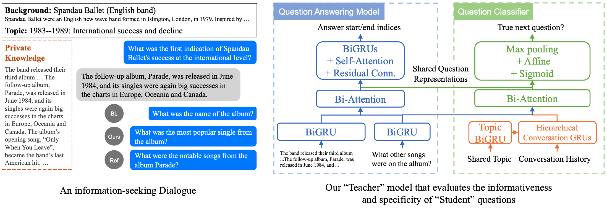

## Stay Hungry, Stay Focused

This repository hosts the authors' implementation of the paper "Stay Hungry, Stay Focused: Generating Informative and Specific Questions in Information-Seeking Conversations", published in Findings of EMNLP 2020.



Check out our [paper](https://arxiv.org/pdf/2004.14530.pdf) and [blog post](https://qipeng.me/blog/learning-to-ask/) about this work for more details!

### Using the code

This section covers details about how you can use the code in this repository to replicate the experiments in the paper.

#### Setting things up

We have included a `setup.sh` file that takes care of downloading the data and models, installing Python requirements, as well as preprocessing the data for training. You can run it in the Shell

```bash
bash setup.sh
```

or run the commands in the script one by one as you please.

Note that PyTorch 1.4.0, which is required by this repository, might not install correctly with `pip install` on all platforms. You're encouraged to seek alternative means to install PyTorch first before running this script if possible (see the [PyTorch website](https://pytorch.org) for details).

#### Running prediction

With the models downloaded and data preprocessed, you can run prediction from the finetuned model as follows

```bash
python main.py --model_dir trained --mode predict --finetuned
```

The script will print a tab-separated set of evaluation output that is formatted for ease of reading and processing with scripts, which looks like

```
====================
<WIKITITLE> [Wikipedia title] </WIKITITLE> <BG> [Background paragraph] </BG> \t <SECTITLE> [Wikipedia section title under discussion] </SECTITLE> \t [1st reference question] \t [1st generated question]
Metrics: [Teacher metric for the 1st reference question] [Teacher metric for the 1st generated question]
\t <ANS> [Answer to the 1st reference question] </ANS> \t [2nd reference question] \t [2nd generated question]
Metrics: [Teacher metric for the 2nd reference question] [Teacher metric for the 2nd generated question]
\t <ANS> [Answer to the 2nd reference question] </ANS> \t [3rd reference question] \t [3rd generated question]
...
```

This format is also used by our scripts in `human_eval/` to generate human-evaluation-related files, including the survey form.

A few useful flags:

* `--teacher_spec_only` and `--teacher_info_only` (used separately), switch the printed teacher metrics to the specificity or informativenessd metrics, respetively. By default, the printed metric is the mixture between the two.
* `--finetuned`, when removed from the command above, generates predictions from the baseline model instead of the finetuned one.
* `--batch_size N`, where `N` is an integer (default 10), can be configured to reduce memory usage if you run our of GPU memory during training or evaluation.

#### Training

The training commands for the baseline, teacher, and finetuned models are

```
# Baseline question generator
python main.py --model_dir trained_models --top 1016 --mode train

# Teacher's question answering and specificity models
python main.py --model_dir trained_models --top 1016 --mode train_teacher

# Finetune the baseline model to improve informativeness and specificity
python main.py --model_dir trained_models --top 1016 --mode finetune
```

Here, `--topn 1016` tells the script to only finetune the word embeddings of the top 1000 most frequent words in the training set, as well as those for the artificial symbols we introduced.

Aside from these, some hyperparameters might also be useful if one is keen to tune the model oneself:

* `--lambda1 LAMBDA1` where `LAMBDA1` is the mixture weight between the informativeness and specificity rewards during finetuning (default: 0.5).
* `--lambda2 LAMBDA2` where `LAMBDA2` controls the mixture between the negative log likelihood loss and the policy gradient loss during finetuning (default: 0.98).

### Citation

```
@inproceedings{qi2020stay,
  title = {Stay Hungry, Stay Focused: Generating Informative and Specific Questions in Information-Seeking Conversations},
  booktitle = {Findings of {ACL}: {EMNLP} 2020),
  author = {Qi, Peng and Zhang, Yuhao and Manning, Christopher D.},
  year = {2020}
}
```

### License

The code is released under Apache License V2. See the `LICENSE` file in the repository for more details.
